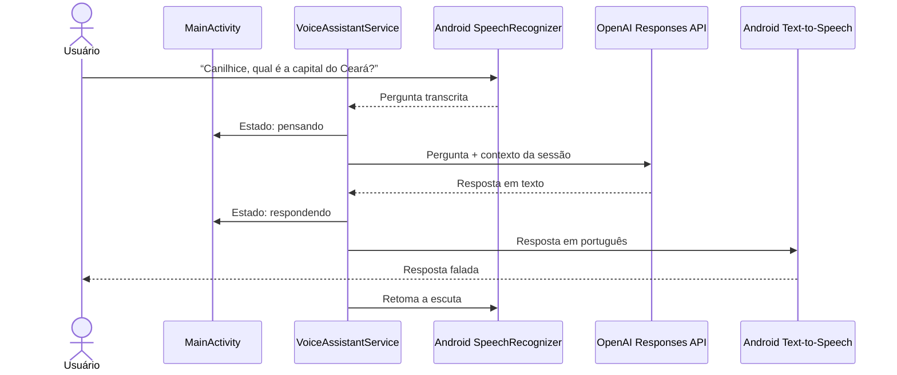

# Canilhice — Assistente de voz com IA para Android

Aplicativo Android nativo que transforma voz em uma conversa com inteligência artificial. Ao ouvir o nome **“Canilhice”**, o app reconhece a pergunta, consulta a OpenAI e reproduz a resposta em português usando a voz do aparelho.

O projeto foi desenvolvido como estudo prático de Android, integração com APIs de IA, processamento de voz, serviços em primeiro plano e proteção de dados sensíveis.

## Destaques

- Ativação por voz com tolerância a diferentes pronúncias de “Canilhice”.
- Reconhecimento de perguntas em português do Brasil.
- Respostas geradas pela OpenAI Responses API.
- Conversão da resposta em áudio com Android Text-to-Speech.
- Continuidade de contexto durante a sessão.
- Escuta executada em um foreground service com notificação permanente.
- Interface minimalista com robô, nome e animações por estado.
- Ícone adaptável para o menu de aplicativos do Android.
- Chave da API cifrada com AES-GCM e protegida pelo Android Keystore.
- Mensagens amigáveis para erros de autenticação, créditos e conexão.

## Demonstração do fluxo



## Arquitetura

O MVP utiliza uma arquitetura orientada a responsabilidades, mantendo a interface independente do processamento de voz e da integração externa.

```text
com.canilhice.assistant
├── MainActivity.kt             # Interface, permissões e animações
├── VoiceAssistantService.kt    # Ciclo de escuta, estados e síntese de voz
├── OpenAiClient.kt             # Comunicação com a Responses API
└── SecureKeyStore.kt           # Cifragem e persistência da chave
```

| Componente | Responsabilidade |
|---|---|
| `MainActivity` | Renderiza a interface, solicita permissões e reage aos estados do assistente. |
| `VoiceAssistantService` | Mantém a escuta em primeiro plano e coordena reconhecimento, API e voz. |
| `OpenAiClient` | Monta a requisição, mantém o contexto da sessão e interpreta a resposta. |
| `SecureKeyStore` | Gera uma chave AES no Android Keystore e cifra a credencial da API. |

Os estados `idle`, `listening`, `thinking`, `speaking` e `error` são enviados pelo serviço para a interface. Cada estado altera textos e animações sem acoplar a tela à implementação da API.

## Tecnologias

- Kotlin e Android SDK
- Material Components
- Android SpeechRecognizer
- Android Text-to-Speech
- Foreground Service
- Android Keystore e AES-GCM
- OpenAI Responses API
- Gradle e Java 17

## Segurança e privacidade

- A chave da API não fica escrita no código-fonte.
- A credencial é cifrada no aparelho e a chave criptográfica permanece no Android Keystore.
- O aplicativo bloqueia tráfego HTTP sem criptografia.
- Preferências protegidas são excluídas de backup e migração entre aparelhos.
- Uma notificação informa ao usuário enquanto o microfone está ativo.
- O áudio pode ser processado pelo provedor de reconhecimento configurado no Android.

> Esta implementação direta é apropriada para demonstração pessoal. Em uma publicação para múltiplos usuários, a chamada à OpenAI deve passar por um backend autenticado. Assim, nenhuma chave compartilhada é distribuída dentro do aplicativo.

## Como executar

### Requisitos

- Android Studio com JDK 17
- Android SDK 35
- Aparelho ou emulador com Android 8.0 (API 26) ou superior
- Reconhecimento e síntese de voz em português instalados
- Chave da OpenAI com créditos de API

### Instalação

1. Clone ou abra este projeto no Android Studio.
2. Aguarde a sincronização do Gradle.
3. Conecte um aparelho com depuração USB/Wi-Fi ou inicie um emulador.
4. Selecione o dispositivo e clique em **Run**.
5. Informe uma chave criada em `https://platform.openai.com/api-keys`.
6. Toque em **Escutar**, diga “Canilhice” e faça uma pergunta.

A chave fica salva de forma cifrada; não é necessário digitá-la a cada execução.

## Build e qualidade

```powershell
./gradlew.bat :app:assembleDebug :app:lintDebug
```

Como o projeto pode estar dentro do OneDrive, os arquivos intermediários são direcionados para `%LOCALAPPDATA%/CanilhiceBuild/app`, evitando bloqueios durante a geração do DEX.

O APK de desenvolvimento fica em:

```text
%LOCALAPPDATA%/CanilhiceBuild/app/outputs/apk/debug/app-debug.apk
```

## Decisões e aprendizados

- Resultados parciais do reconhecimento servem apenas para feedback visual; a pergunta é enviada somente após o resultado final, evitando frases cortadas.
- Pausas de silêncio foram ajustadas para permitir perguntas mais naturais.
- A síntese de voz é inicializada de forma assíncrona e as respostas aguardam até o mecanismo ficar pronto.
- A escuta é suspensa durante a fala do assistente para evitar que ele reconheça a própria voz.
- Variações fonéticas do nome são tratadas antes de extrair a pergunta.
- Erros externos são traduzidos para mensagens compreensíveis ao usuário.

## Roadmap

- [ ] Criar backend autenticado para intermediar a API.
- [ ] Adicionar detector offline dedicado para a palavra de ativação.
- [ ] Implementar injeção de dependências e camadas de domínio/dados.
- [ ] Adicionar testes unitários, instrumentados e de interface.
- [ ] Criar pipeline de integração contínua.
- [ ] Permitir histórico local opcional de conversas.
- [ ] Adicionar tela de configurações para voz e tempo de escuta.

